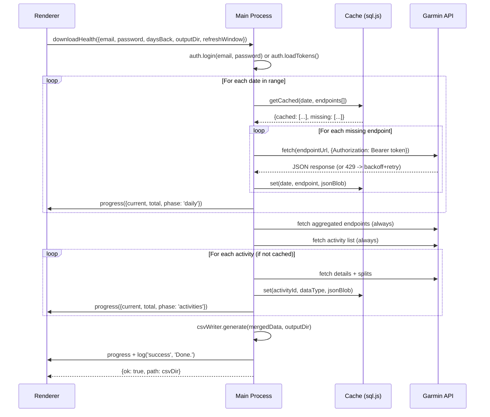

# Replace Python Backend with In-Process Node.js + SQLite Cache

## Overview

Replace the three-step Python subprocess pipeline (garmin_health_export.py -> json_to_csv.py -> download_activity_details.py) with a single in-process JavaScript module running in Electron's main process. Add an SQLite incremental cache (via sql.js WASM) so repeat exports only fetch new/recent data, achieving >=80% API call reduction on re-runs.

## Problem Frame

The Garmin Health Exporter hits HTTP 429 account-level rate limits because it makes 22+ API calls per day x N days with no caching — every run re-fetches everything. Additionally, the Python/uv dependency chain causes onboarding friction (CLT install, Homebrew fallback, quarantine issues on macOS).

This rewrite solves both problems: an incremental cache slashes API call volume, and consolidating to JavaScript eliminates all Python dependencies. (see origin: docs/brainstorms/2026-04-16-node-backend-rewrite-requirements.md)

## Requirements Trace

- R1. Hand-roll Garmin Connect API client using fetch — no third-party Garmin npm package
- R2. Implement all 22 per-day + 12 aggregated + 3 per-activity detail endpoints + 2 list endpoints (activities_by_date, goals)
- R3. OAuth/SSO auth with persistent token caching (mode 0600)
- R4. Same JSON output schema as Python backend
- R5. SQLite cache keyed by (date, endpoint) and (activity_id, data_type)
- R6. Skip cached data outside refresh window (aggregated endpoints exempt per R8)
- R7. Configurable refresh window dropdown on export form (1-7 days, default 3)
- R8. Aggregated endpoints and activity lists always re-fetched
- R9. Port json_to_csv.py to JS with schema-compatible CSV output
- R10. Port activity-type grouping and CSV export to JS
- R11. Exponential backoff on 429; immediate fail + token clear on 401/403
- R12. Configurable inter-request delay (default 500ms)
- R13-R15. Remove all Python scripts, uv logic, setup IPC handlers, extraResources config
- R16-R18. Preserve progress/log IPC events and output directory structure

## Scope Boundaries

- No Go/Rust/Bun — staying in JS/Electron ecosystem
- No official Garmin Health API — separate initiative
- No FIT file parsing — API remains data source
- No background/scheduled sync — manual trigger only
- No worker threads — main thread with async/await is sufficient

## Context & Research

### Relevant Code and Patterns

- `electron-app/main.js` — IPC handlers, subprocess spawning (to be replaced)
- `electron-app/preload.js` — context bridge with 11 methods (mostly preserved)
- `electron-app/renderer/index.html` — single-file UI, sidebar with 4 sections, terminal panel
- `electron-app/scripts/*.py` — three Python scripts (to be deleted)
- `electron-app/package.json` — Electron 33, electron-builder with extraResources

### Garmin Connect API Endpoint Map

All endpoints use base URL `https://connectapi.garmin.com` (confirmed by auth spike — NOT `connect.garmin.com`). Key services:

| Service | Endpoints | Examples |
|---------|-----------|---------|
| usersummary-service | stats, user_summary, hydration, daily_steps, weekly_steps | `/usersummary-service/usersummary/daily/{displayName}?calendarDate={date}` |
| wellness-service | heart_rates, stress, sleep, body_battery, respiration, spo2, steps, intensity_minutes | `/wellness-service/wellness/dailyHeartRate/{displayName}?date={date}` |
| metrics-service | training_readiness, training_status, max_metrics, endurance_score, running_tolerance, hill_score, race_predictions | `/metrics-service/metrics/trainingreadiness/{date}` |
| weight-service | weigh_ins, body_composition | `/weight-service/weight/dayview/{date}?includeAll=true` |
| activity-service | activity_details, splits, typed_splits | `/activity-service/activity/{id}/details?maxChartSize=2000` |
| activitylist-service | activities_by_date | `/activitylist-service/activities/search/activities?startDate=...&endDate=...` |
| hrv-service | hrv | `/hrv-service/hrv/{date}` |
| bloodpressure-service | blood_pressure | `/bloodpressure-service/bloodpressure/range/{start}/{end}` |
| biometric-service | lactate_threshold, cycling_ftp | `/biometric-service/biometric/latestFunctionalThresholdPower/CYCLING` |
| fitnessage-service | fitness_age | `/fitnessage-service/fitnessage/{date}` |
| goal-service | goals | `/goal-service/goal/goals?status=active` |
| fitnessstats-service | progress_summary | `/fitnessstats-service/activity?startDate=...&endDate=...` |

### Auth Flow (from garth/garminconnect Python source)

1. Fetch OAuth consumer key/secret from `https://thegarth.s3.amazonaws.com/oauth_consumer.json`
2. GET `sso.garmin.com/sso/embed` (establish cookies, 16 tracked) → GET `/sso/signin` (extract CSRF token from HTML)
3. POST credentials + CSRF to `/sso/signin` with browser User-Agent → extract service ticket from HTML response
4. GET `connectapi.garmin.com/oauth-service/oauth/preauthorized?ticket=...` with OAuth1 HMAC-SHA1 signed header (mobile User-Agent) → receive OAuth1 token
5. POST OAuth1 token to `/oauth-service/oauth/exchange/user/2.0` with OAuth1 signature as query params → receive OAuth2 Bearer token (expires ~26.6h, refresh ~30d)
6. Store oauth1_token + oauth2_token as JSON on disk (mode 0600)
7. On subsequent runs: load tokens, check oauth2 expiry, refresh via OAuth1→OAuth2 exchange if expired
8. All API calls use `Authorization: Bearer {access_token}` header + mobile User-Agent

## Key Technical Decisions

- **sql.js (WASM) over better-sqlite3**: No native module rebuild needed, avoids electron-rebuild complexity. Synchronous API after initial WASM load (use `await initSqlJs()` once at startup, then all DB ops are sync). Slightly slower than native but sufficient for a cache of JSON blobs (see origin)
- **Main thread with async/await over worker threads**: All API calls are async fetch, sql.js is synchronous after WASM init. CSV generation is fast enough in practice. Simplest architecture (see origin)
- **Hand-rolled API client**: The `garmin-connect` npm v1.6.2 (currently installed but unused) covers only ~8 of ~36 endpoints and was last published Jan 2024. Remove it as a dependency (see origin)
- **Single cache table + activity table**: Simple schema, no per-endpoint normalization needed. Two tables cover the two key patterns (date-keyed and activity-keyed)
- **Token storage in `app.getPath('userData')`**: More conventional for Electron apps than a dotfile in home. File written with mode 0600

## Open Questions

### Resolved During Planning

- **SQLite library**: sql.js (WASM) — avoids native module complexity
- **Threading model**: Main thread with async/await — simplest, sufficient for workload
- **API endpoint URLs**: Fully mapped from garminconnect Python source (see table above)
- **Token storage**: `app.getPath('userData')/garmin-tokens.json` with mode 0600

### Deferred to Implementation

- **Exact garth auth flow reproduction**: The Python `garth` library is deprecated but `garminconnect` implements updated mobile SSO directly. JS implementation should follow `garminconnect`'s current auth code, not garth's
- **Auto-pagination for activities**: `get_activities_by_date` paginates in batches of 20. Implementation needs to handle this loop
- **Auto-chunking for daily_steps**: Garmin limits date ranges to 28 days. Implementation needs date-range chunking
- **CSV float formatting**: Python `repr()` vs JS `toString()` may differ for edge-case floats. Defer to implementation-time testing against a reference CSV corpus

## High-Level Technical Design

> *This illustrates the intended approach and is directional guidance for review, not implementation specification. The implementing agent should treat it as context, not code to reproduce.*

```
electron-app/
  main.js                      -- Simplified: IPC handlers call garmin/ modules directly
  preload.js                   -- Unchanged (same context bridge)
  renderer/
    index.html                 -- Add refresh-window dropdown to sidebar section 02
  garmin/
    auth.js                    -- OAuth/SSO login, token refresh, token persistence
    client.js                  -- GarminClient class: authenticated fetch wrapper
    endpoints.js               -- All 36+ endpoint definitions (URL patterns, params)
    cache.js                   -- sql.js cache: init, get, set, clear, schema migration
    exporter.js                -- Orchestrator: check cache -> fetch missing -> merge -> emit progress
    csv-writer.js              -- Port of json_to_csv.py + activity details CSV logic
  package.json                 -- Remove garmin-connect, add sql.js
```



## Implementation Units

- [ ] **Unit 0: Auth Spike (Timeboxed PoC)**

**Goal:** Prove that the Garmin Connect mobile SSO flow can be replicated in JavaScript using `fetch` before committing to the full rewrite. Timeboxed to 1-2 hours.

**Requirements:** R1, R3

**Dependencies:** None

**Files:**
- Create: `electron-app/garmin/auth-spike.js` (throwaway — findings feed into Unit 1)

**Approach:**
- Attempt the full mobile SSO flow in a standalone Node.js script:
  1. POST credentials to `https://sso.garmin.com/mobile/api/login`
  2. Handle CSRF tokens, cookie jars (manually track `Set-Cookie` headers), and redirect chains
  3. Exchange service ticket for Bearer tokens via `https://diauth.garmin.com`
  4. Make one authenticated API call (e.g., `get_user_summary`) to confirm the token works
- Reference `garminconnect` Python source directly — the plan's auth summary is directional, not a complete spec
- Document any surprises: captcha challenges, MFA prompts, unexpected redirects, required headers

**Exit criteria:**
- **Pass:** Successfully retrieve a valid Bearer token and make one authenticated API call → proceed with Unit 1 using the proven flow
- **Fail:** Cannot replicate auth after 2 hours → stop, reassess the rewrite approach (consider wrapping the Python auth only, or using a headless browser for auth)

**This unit de-risks the entire rewrite. Do not proceed to other units until this passes.**

---

- [ ] **Unit 1: Garmin Auth Module**

**Goal:** Implement the OAuth/SSO login flow and token persistence so all subsequent units can make authenticated API calls.

**Requirements:** R1, R3

**Dependencies:** None

**Files:**
- Create: `electron-app/garmin/auth.js`
- Test: `electron-app/garmin/__tests__/auth.test.js`

**Approach:**
- Replicate the mobile SSO flow proven in Unit 0. The plan's 6-step auth summary is directional — the implementer should read `garminconnect`'s Python auth source directly for the full flow, including: CSRF token extraction, cookie jar management across redirects, required headers (User-Agent, origin), and the exact token exchange sequence. Unit 0's spike findings should document these details
- Store tokens as JSON at `app.getPath('userData')/garmin-tokens.json` with `fs.writeFileSync(path, data, {mode: 0o600})`
- On subsequent calls, load tokens from disk, check expiry, refresh via refresh_token grant if needed
- Export: `login(email, password)`, `loadTokens()`, `getAccessToken()`, `clearTokens()`

**Patterns to follow:**
- The existing `main.js` uses `{ok, error}` return pattern for IPC — auth module should use similar result objects
- Python's token cache at `~/.garmin_exporter_tokens/` uses `garth.dump()` format (JSON files) — new format will be simpler (single JSON file)

**Test scenarios:**
- Happy path: login with valid credentials returns access_token and writes token file
- Happy path: loadTokens reads existing token file and returns valid session
- Happy path: expired access_token triggers refresh_token exchange, writes updated tokens
- Error path: login with invalid credentials returns `{ok: false, error: 'Invalid credentials'}`
- Error path: refresh_token expired — clears token file, returns error prompting re-login
- Edge case: token file missing or corrupted JSON — graceful fallback to fresh login
- Edge case: token file exists but has wrong permissions — overwrite with correct mode 0600

**Verification:**
- Can authenticate against Garmin Connect and receive a valid Bearer token
- Token file is created/updated at the expected path with mode 0600
- Expired tokens trigger refresh without user re-entering credentials

---

- [ ] **Unit 2: Garmin API Client + Endpoint Definitions**

**Goal:** Create an authenticated HTTP client and define all ~36 endpoint URL patterns so the exporter can call any Garmin endpoint by name.

**Requirements:** R1, R2, R11, R12

**Dependencies:** Unit 1 (auth module)

**Files:**
- Create: `electron-app/garmin/client.js`
- Create: `electron-app/garmin/endpoints.js`
- Test: `electron-app/garmin/__tests__/client.test.js`

**Approach:**
- `client.js`: `GarminClient` class wrapping `fetch` with:
  - Auto-injection of `Authorization: Bearer` header from auth module
  - Configurable inter-request delay (R12, default 500ms) via `await sleep(delay)` between calls
  - 429 retry with exponential backoff + jitter (R11): `delay = min(5000 * 2^attempt + random(0, 1000), 60000)`, up to 5 retries
  - 401/403 handling: immediate fail, call `auth.clearTokens()`, return error
  - A `safe(endpointName, ...args)` wrapper matching Python's pattern — catches errors, logs, returns null
- `endpoints.js`: Object mapping endpoint names to URL-builder functions:
  - Each entry: `{ name, buildUrl(params), parseResponse?(data) }`
  - Cover all 22 daily, 12 aggregated, and 5 per-activity endpoints
  - Handle auto-pagination for `activities_by_date` and `goals`
  - Handle auto-chunking for `daily_steps` (28-day limit)

**Patterns to follow:**
- Python's `safe()` wrapper pattern from `garmin_health_export.py:30-35` — catch per-endpoint errors without aborting the full export
- Python's endpoint call style: `safe(client.get_stats, d, label="stats")` — replicate as `await client.safe('stats', {date})`

**Test scenarios:**
- Happy path: client.fetch('stats', {date: '2026-04-15'}) returns parsed JSON
- Happy path: inter-request delay is respected between sequential calls
- Error path: 429 response triggers backoff, retries, and eventually succeeds
- Error path: 429 response exhausts all 5 retries — returns error with retry count in message
- Error path: 401 response clears tokens and returns auth error immediately (no retry)
- Error path: network error (ECONNREFUSED) returns error without crashing
- Edge case: activities_by_date paginates through 3 pages of 20 activities each
- Edge case: daily_steps auto-chunks a 90-day range into 4 requests of <=28 days

**Verification:**
- All 36+ endpoints are callable by name and return expected JSON shapes
- Rate limiting is visible in logs (retry messages appear)
- No unhandled promise rejections during any error scenario

---

- [ ] **Unit 3: SQLite Cache Layer**

**Goal:** Implement an incremental cache using sql.js (WASM) so previously fetched data is reused across runs.

**Requirements:** R5, R6, R7, R8

**Dependencies:** None (can be built in parallel with Units 1-2)

**Files:**
- Create: `electron-app/garmin/cache.js`
- Test: `electron-app/garmin/__tests__/cache.test.js`

**Approach:**
- Initialize sql.js with the WASM binary bundled via npm. Database file stored at `app.getPath('userData')/garmin-cache.db`
- Two tables:
  - `daily_cache(date TEXT, endpoint TEXT, json_blob TEXT, fetched_at TEXT, PRIMARY KEY(date, endpoint))`
  - `activity_cache(activity_id TEXT, data_type TEXT, json_blob TEXT, fetched_at TEXT, PRIMARY KEY(activity_id, data_type))`
- `getCachedDaily(date, endpointName)` — returns cached blob or null
- `setCachedDaily(date, endpointName, jsonBlob)` — upsert
- `getCachedActivity(activityId, dataType)` — returns cached blob or null
- `setCachedActivity(activityId, dataType, jsonBlob)` — upsert
- `isWithinRefreshWindow(date, refreshDays)` — returns true if date is within N days of today (these should be re-fetched)
- `clearAll()` — drop and recreate tables (for the "clear cache" button)
- `close()` — save database to disk and free WASM memory
- Schema version tracking via a `meta` table for future migrations
- On open: if database file is corrupted or schema version mismatches, recreate from scratch (log warning)

**Patterns to follow:**
- sql.js pattern: `const SQL = await initSqlJs(); const db = new SQL.Database(fileBuffer);` then `db.export()` to save
- Electron's `app.getPath('userData')` for persistent app data

**Test scenarios:**
- Happy path: set then get returns the same JSON blob for a daily endpoint
- Happy path: set then get returns the same JSON blob for an activity
- Happy path: isWithinRefreshWindow returns true for today, false for 10 days ago (with refreshDays=3)
- Happy path: clearAll removes all data, subsequent gets return null
- Edge case: duplicate set (same key) overwrites previous value
- Edge case: database file missing on first run — creates new database
- Edge case: database file corrupted — recreates from scratch, logs warning
- Edge case: schema version mismatch — recreates from scratch
- Integration: cache survives close() + reopen cycle (data persists to disk)

**Verification:**
- Cache file appears at expected userData path after first write
- Second run with same parameters returns cached data without API calls
- clearAll followed by export triggers full re-fetch

---

- [ ] **Unit 4: Export Orchestrator**

**Goal:** Wire auth, client, cache, and progress reporting into a single export pipeline that replaces the three Python scripts.

**Requirements:** R4, R6, R8, R16, R17, R18

**Dependencies:** Units 1, 2, 3

**Files:**
- Create: `electron-app/garmin/exporter.js`
- Test: `electron-app/garmin/__tests__/exporter.test.js`

**Approach:**
- `exportHealth({email, password, daysBack, outputDir, refreshWindow, onProgress, onLog})`:
  - **Callback signatures:**
    - `onProgress({current: number, total: number, phase: 'daily'|'aggregated'|'activities'|'csv'})`
    - `onLog({type: 'dim'|'info'|'warn'|'success', message: string})`
  - **Return value:** `{ok: true, jsonPath: string, csvDir: string}` on success, `{ok: false, error: string}` on failure
  - **Steps:**
  1. Authenticate (login or load tokens)
  2. For each date in range:
     - Check cache for each of the 22 daily endpoints
     - Skip cached entries outside the refresh window
     - Fetch missing entries, store in cache
     - Emit `onProgress({current, total, phase: 'daily'})`
  3. Fetch all 12 aggregated endpoints (always, per R8)
  4. Fetch activity list (always, per R8)
  5. For each activity:
     - Check activity cache for splits, typed_splits, details (get_activity_details with maxChartSize=2000)
     - Fetch if not cached
     - Emit `onProgress({current, total, phase: 'activities'})`
  6. Merge cached + fresh data into the same JSON structure as Python output
  7. Write JSON file: `garmin_health_YYYY-MM-DD_HH-MM-SS.json`
  8. Return the JSON file path
- The `onProgress` and `onLog` callbacks replace stdout parsing — main.js forwards them directly to the renderer via `event.sender.send()`

**Patterns to follow:**
- Python's `data` dict structure from `garmin_health_export.py:75-82`: `{export_date, date_range, daily: {}, aggregated: {}, activities: [], goals: []}`
- Python's `PROGRESS:phase:current:total` protocol — replicate as direct callback calls
- Python's `safe()` pattern — skip failed endpoints without aborting

**Test scenarios:**
- Happy path: full export with empty cache fetches all endpoints and writes JSON
- Happy path: second run with populated cache skips cached daily data, re-fetches aggregated
- Happy path: progress callbacks fire with correct current/total/phase values
- Happy path: output JSON matches expected schema (export_date, date_range, daily, aggregated, activities, goals)
- Edge case: refresh window of 1 day only re-fetches today's data
- Edge case: refresh window of 7 days re-fetches the full week
- Error path: single endpoint failure (e.g., spo2) skips that metric, logs warning, continues
- Error path: auth failure mid-export (401) stops export, clears tokens, returns error
- Integration: cached activity details are reused when activity list includes previously-seen IDs

**Verification:**
- JSON output file structure matches Python-generated JSON (same top-level keys, same nesting)
- Progress events arrive in correct order: daily -> aggregated -> activities
- Cache database grows after first run, API call count drops on second run

---

- [ ] **Unit 5: CSV Writer**

**Goal:** Port json_to_csv.py and download_activity_details.py CSV logic to JavaScript, producing schema-compatible CSV output.

**Requirements:** R9, R10

**Dependencies:** None (can be built in parallel with Units 1-4; only needs sample JSON for testing, not the exporter module)

**Files:**
- Create: `electron-app/garmin/csv-writer.js`
- Test: `electron-app/garmin/__tests__/csv-writer.test.js`

**Approach:**
- Port `flatten()` recursive dict flattener from `json_to_csv.py:43-55`
- Port all 14 CSV extractors (daily_stats, heart_rates, sleep, stress, etc.) from `json_to_csv.py`
- Port activity-type grouping from `download_activity_details.py:29-33` (TYPE_GROUPS: caminar, correr, gym)
- Port `flatten_details()` and `flatten_laps()` from `download_activity_details.py`
- Use manual CSV writing (no library): header row + data rows, proper quoting for fields containing commas/quotes/newlines
- Match Python's csv.QUOTE_MINIMAL behavior: only quote fields that need it
- For nested objects/arrays, use `JSON.stringify()` (matches Python's `json.dumps()`)
- Output to `csv_YYYY-MM-DD/` directory with same filenames as Python
- Generate a reference CSV corpus from current Python pipeline during development for comparison

**Patterns to follow:**
- Python's `write_csv(rows, path)` pattern from `json_to_csv.py`
- Python's extractor pattern: each function takes the full data dict and returns `[rows]`
- Activity CSV field list from `download_activity_details.py:36-45` (SUMMARY_FIELDS)

**Test scenarios:**
- Happy path: flatten({a: {b: 1, c: {d: 2}}}) returns {a_b: 1, a_c_d: 2}
- Happy path: generate daily_stats CSV from sample JSON — correct columns and row count
- Happy path: generate activity CSVs grouped by type — caminar, correr, gym files created
- Edge case: nested list/dict values are serialized as JSON strings in CSV cells
- Edge case: null/undefined values render as empty strings (matching Python's None behavior)
- Edge case: float values like 1.0 render as "1" or "1.0" consistently
- Edge case: CSV field containing comma is properly quoted
- Edge case: empty activities list produces no activity CSV files (not empty files)
- Integration: full pipeline (JSON -> CSV) produces files with same column headers as Python output

**Verification:**
- **Before deleting Python scripts (during Unit 5 development):** Generate a reference CSV corpus from the current Python pipeline for a sample date range. Save column headers from each CSV file as `electron-app/garmin/__tests__/fixtures/csv-headers.json`
- Column headers match the reference corpus exactly (automated test in `csv-writer.test.js`)
- File names and directory structure match: `csv_YYYY-MM-DD/daily_stats.csv`, etc.
- Spot-check numeric values against Python output for a sample date range

---

- [ ] **Unit 6: IPC Integration + Main.js Rewrite**

**Goal:** Replace the Python subprocess pipeline in main.js with direct calls to the new garmin/ modules. Clean up all Python/uv-related code.

**Requirements:** R13, R14, R15, R16, R17

**Dependencies:** Units 4, 5

**Files:**
- Modify: `electron-app/main.js`
- Modify: `electron-app/preload.js`

**Approach:**
- Rewrite `download-health` IPC handler to:
  1. Accept `{email, password, daysBack, outputDir, refreshWindow}` (add refreshWindow param)
  2. Validate IPC inputs: `daysBack` is a positive integer (1-90), `refreshWindow` is an integer (1-7), `outputDir` is an absolute path within the user's home directory (path traversal guard)
  3. Guard against concurrent exports: reject if an export is already in progress
  4. Call `exporter.exportHealth(...)` with `onProgress` and `onLog` callbacks that forward to `event.sender.send()`
  5. Call `csvWriter.generate(jsonData, outputDir)` after export
  6. Return `{ok: true, path: csvDir}`
- Remove: `resolveUv()`, `uvOk()`, `brewBin()`, `cltInstalled()`, `patchPath()`, `runStreamed()`
- Remove: `check-deps`, `install-deps`, `setup-required` IPC handlers
- Remove: the `mainWindow.webContents.once('did-finish-load', ...)` uv check
- Add: `clear-cache` IPC handler calling `cache.clearAll()`
- Update preload.js:
  - Add `clearCache()` method
  - Add `refreshWindow` to `downloadHealth` opts type
  - Remove `checkDeps()`, `installDeps()`, `onSetupRequired()`, `onSetupLog()`

**Patterns to follow:**
- Existing `download-health` handler's guard pattern: `if (!event.sender.isDestroyed())` before every send
- Existing `{ok, error}` return convention

**Test scenarios:**
- Happy path: downloadHealth IPC call triggers export and returns {ok: true, path}
- Happy path: progress events arrive at renderer with correct phase/current/total
- Happy path: log events arrive with correct type (dim/info/warn/success)
- Happy path: clearCache IPC call clears the database
- Error path: auth failure returns {ok: false, error} with descriptive message
- Error path: window closed mid-export — no crash (isDestroyed guard)
- Edge case: refreshWindow parameter defaults to 3 if not provided

**Verification:**
- Export runs end-to-end without spawning any Python process
- `uv` is not referenced anywhere in the codebase
- All IPC channels listed in preload.js have matching handlers in main.js

---

- [ ] **Unit 7: UI Updates (Refresh Window + Clear Cache)**

**Goal:** Add the refresh window dropdown to the export form and a clear cache button. Remove the setup/install overlay.

**Requirements:** R7, R15

**Dependencies:** Unit 6 (IPC handlers must exist)

**Files:**
- Modify: `electron-app/renderer/index.html`

**Approach:**
- In sidebar section 02 (Date Range), add a `<select>` dropdown for refresh window:
  - Options: 1, 2, 3 (default), 5, 7 days
  - Label: "Refresh window" with a small info tooltip explaining what it does
  - Style to match existing form elements (dark theme, red accent, Oxanium font)
  - Save selection to `localStorage` key `garmin_refresh_window`
  - Pass value to `garmin.downloadHealth()` call
- **Stop persisting password in localStorage.** Currently `garmin_pass` is stored in plaintext on disk. After the rewrite, the refresh token in `garmin-tokens.json` (mode 0600) handles re-authentication. Changes:
  - Remove `localStorage.setItem('garmin_pass', ...)` and `localStorage.getItem('garmin_pass')`
  - Keep only `garmin_email` in localStorage (pre-fill convenience)
  - Password field starts empty on each launch — user enters it only when tokens are expired/missing
  - On successful auth, the UI can show "Authenticated" status and disable the password field until tokens expire
  - Remove any existing `garmin_pass` from localStorage on first launch of the new version
- Add a "Clear Cache" link/button in the sidebar footer or near the output section
  - Calls `garmin.clearCache()`, shows brief confirmation in terminal
- Remove the setup overlay/screen that appears when uv is missing:
  - Remove `onSetupRequired` listener
  - Remove `onSetupLog` listener
  - Remove any setup-related DOM elements and CSS
  - Remove `checkDeps()` call on load

**Patterns to follow:**
- Existing slider in section 02 for styling reference
- Existing `localStorage` pattern for `garmin_email`, `garmin_pass`, `garmin_dir`
- Existing button styling (`.btn` class) for the clear cache button

**Test scenarios:**
- Happy path: refresh window dropdown appears in section 02, defaults to 3
- Happy path: changing dropdown value persists to localStorage and survives app restart
- Happy path: selected refresh window value is passed to downloadHealth
- Happy path: clear cache button triggers cache clear and shows confirmation log
- Edge case: localStorage has no saved refresh window — defaults to 3
- Error path: clear cache when no cache exists — no error, shows "Cache already empty"

**Verification:**
- The export form has a visible refresh window control
- No setup/install overlay appears on fresh launch
- The refresh window value affects which days are re-fetched (visible in log output)

---

- [ ] **Unit 8: Cleanup + Package Config**

**Goal:** Remove all Python artifacts and update package.json / electron-builder config.

**Requirements:** R13, R14, R15

**Dependencies:** Units 6, 7 (all Python references removed from code first)

**Files:**
- Delete: `electron-app/scripts/garmin_health_export.py`
- Delete: `electron-app/scripts/json_to_csv.py`
- Delete: `electron-app/scripts/download_activity_details.py`
- Modify: `electron-app/package.json`

**Approach:**
- **Only delete Python scripts after the JS pipeline is verified end-to-end** (successful export + CSV output comparison against reference corpus). This is the last step in the entire rewrite — do not delete early
- Delete the three Python scripts from `electron-app/scripts/`
- In package.json:
  - Remove `garmin-connect` from dependencies (no longer used)
  - Add `sql.js` to dependencies
  - Remove `extraResources` entries for the Python scripts from electron-builder config
  - Add `"node_modules/sql.js/dist/sql-wasm.wasm"` to `asarUnpack` so the WASM binary is accessible at runtime
  - Verify the `files` glob still includes the new `garmin/` directory
- Verify `npm run dist` builds successfully without the Python scripts

**Test expectation:** none — pure config and file deletion, verified by successful build

**Verification:**
- `npm run dist:dir` produces an app that launches and runs an export
- No Python files exist in the built app bundle
- `sql.js` WASM binary is included in the bundle
- `garmin-connect` package is not in node_modules after clean install

## System-Wide Impact

- **Interaction graph:** The `download-health` IPC handler is the only entry point. It currently spawns 3 sequential subprocesses; after the rewrite it calls 3 internal modules directly. The renderer's `onProgress` and `onLog` listeners are unchanged.
- **Error propagation:** Errors from the API client bubble up through the exporter to the IPC handler, which returns `{ok: false, error}`. No change to renderer error handling.
- **State lifecycle risks:** The SQLite cache introduces persistent state. Corrupted cache -> recreate from scratch. Schema migration -> version check on open. No partial-write risk because sql.js writes atomically via `db.export()`.
- **API surface parity:** The preload bridge gains `clearCache()` and adds `refreshWindow` to `downloadHealth` opts. It loses `checkDeps()`, `installDeps()`, `onSetupRequired()`, `onSetupLog()`. The renderer must be updated accordingly.
- **Unchanged invariants:** The output JSON schema (R4), CSV column structure (R9), directory naming convention (R18), and progress/log IPC protocol (R16, R17) are all preserved exactly.

## Risks & Dependencies

| Risk | Mitigation |
|------|------------|
| Garmin changes SSO/OAuth flow, breaking auth | Auth module is isolated in `auth.js`; update only that file. Monitor garminconnect Python repo for flow changes |
| sql.js WASM binary not bundled correctly by electron-builder | Add `"node_modules/sql.js/dist/sql-wasm.wasm"` to `asarUnpack` in electron-builder config. Verify WASM file loads at runtime. Test with `npm run dist:dir` |
| First run still hits all endpoints (no cache) | R11 backoff + R12 delay spread requests. Consider a "first-run mode" that fetches only 7 days initially |
| API endpoint URLs change | All URLs centralized in `endpoints.js` — single file to update |
| CSV output drift from Python | Generate reference CSV corpus from Python pipeline before deletion. Diff column headers in CI |

## Sources & References

- **Origin document:** [docs/brainstorms/2026-04-16-node-backend-rewrite-requirements.md](docs/brainstorms/2026-04-16-node-backend-rewrite-requirements.md)
- **Garmin Connect API endpoints:** Mapped from [cyberjunky/python-garminconnect](https://github.com/cyberjunky/python-garminconnect) source
- **Auth flow:** Derived from garminconnect Python library's mobile SSO implementation
- **sql.js documentation:** https://sql.js.org/
