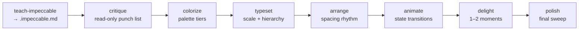

# Iterative UI refinement using impeccable frontend-design skills

## Overview

With audit fixes landed (`docs/plans/2026-04-16-002-refactor-frontend-audit-fixes-plan.md`), the renderer is correct but not yet *refined*. This plan sequences the Impeccable skill suite (`teach-impeccable`, `critique`, `colorize`, `typeset`, `arrange`, `animate`, `delight`, `polish`) to push the "medical telemetry" aesthetic from acceptable to memorable — without dissolving its identity.

The plan names the skills to invoke, the scope each skill is permitted to touch, and the guardrails that keep the aesthetic direction intact across the pass.

## Problem Frame

The renderer works, passes AA, and reads as intentional. It is, however, *safe*. Specifically:
- Color palette is functional but the red accents, teal status, and orange warning never feel like a coordinated system — just three accent hues on near-black.
- Typography is distinctive (Barlow Condensed / Oxanium / JetBrains Mono) but the type scale is flat: lots of 10–12px, one 22px title, nothing in between doing meaningful hierarchy work.
- Spacing is even but monotonous — every section uses `14px 18px`; the layout lacks rhythm.
- Motion is minimal (pulse, scanline, draw-in ECG) and never reinforces state changes (download start, progress, success, error).
- Zero delight moments. The "Ready" welcome is inert after first paint; success/failure is a banner and nothing more.
- Visual details (progress bar, buttons, focus states) are adequate but not distinctive.

Users of this tool are technical: they want their data exported fast and correctly. But the aesthetic promise — medical/telemetry/industrial — should make *every* screen feel like a piece of professional instrumentation, not a settings dialog with a red accent.

## Requirements Trace

- R1. Establish persistent design context in `.impeccable.md` so future design work does not start cold.
- R2. Produce a written critique of the current UI before changing anything.
- R3. Refine color into a coherent system (primary, dim, glow tiers) with explicit role assignments, keeping AA intact.
- R4. Refine type scale and pairing to create deliberate hierarchy across title, section, field, value, and log tiers.
- R5. Introduce spacing rhythm — varied vertical rhythm between sections, asymmetric where it helps.
- R6. Add motion that reinforces state transitions (idle → running → done/error) without violating reduced-motion.
- R7. Introduce 1–2 delight moments that are aesthetically consistent (not novelty gags).
- R8. Final polish pass removing any lingering inconsistencies.

## Scope Boundaries

- **Non-goal**: Changing the IPC contract or adding features. Pure visual refinement.
- **Non-goal**: Light mode. Out of scope (see prior plan).
- **Non-goal**: Removing the red/telemetry identity. The aesthetic direction is set; refinement sharpens it, not replaces it.
- **Non-goal**: New layouts (sidebar + terminal stays). No route changes, no modal dialogs introduced.
- **Non-goal**: Framework migration.
- **Non-goal**: Responsive/mobile work — desktop Electron only.
- **Non-goal**: Invoking every listed impeccable skill. Skip `bolder`, `overdrive`, `quieter`, `normalize`, `harden`, `adapt`, `clarify`, `distill`, `onboard`, `extract` — they target problems this UI does not currently have.

## Context & Research

### Relevant Code and Patterns

- `electron-app/renderer/index.html` — structure only, post-refactor.
- `electron-app/renderer/renderer.css` — all styles, token system at `:root`.
- `electron-app/renderer/renderer.js` — behavior; motion/state hooks live here.
- `electron-app/main.js` — `backgroundColor` must follow the `--bg` token.
- `docs/plans/2026-04-16-002-refactor-frontend-audit-fixes-plan.md` — prior audit baseline.

### Institutional Learnings

- Audit pass already consolidated tokens; refinement builds on `--bg`, `--text-*`, `--red-*`, `--teal-*`, `--orange-*` without reintroducing ad-hoc `rgba()`.
- Reduced-motion media query already exists — any new animation must respect it.

### External References

- `frontend-design` skill reference files (`typography.md`, `color-and-contrast.md`, `spatial-design.md`, `motion-design.md`, `interaction-design.md`) — the source of truth for each refinement unit.

## Key Technical Decisions

- **Establish design context first.** Run `teach-impeccable` before any design skill touches code; commit the resulting `.impeccable.md` so subsequent skills share the same premise.
- **Critique-before-change.** Run `critique` as a read-only pass. Its output becomes the working punch list for subsequent units; nothing gets changed in this step.
- **One skill per unit.** Apply skills one at a time so each commit is reviewable and revertible. Do not pipeline `colorize → typeset → arrange` into a single diff.
- **Keep the telemetry identity load-bearing.** Every refinement must make the "professional instrumentation" read *stronger*, not softer. If a skill's default output drifts toward generic dark-mode dashboard, push back.
- **OKLCH for any new color work.** When `colorize` introduces a new tier (e.g., red-dim-2 for subtler state indication), express it in OKLCH so lightness shifts stay perceptually uniform against the tinted `--bg`.
- **No new dependencies.** Plain CSS + inline SVG remains the rule. No icon fonts, no CSS-in-JS, no animation libraries.

## Open Questions

### Resolved During Planning

- "Should we run `/bolder` or `/overdrive`?" → No. This is a refinement pass, not a maximalist reinvention. If a future direction is wanted, that's a separate brainstorm.
- "Run skills autonomously or interactively?" → Interactively. Each skill proposes; we accept/modify/reject before committing.
- "One commit or one per skill?" → One per skill. Clean history; easy to revert a specific pass.

### Deferred to Implementation

- Exact new color tier count after `colorize` — depends on what tiers the skill recommends for the current palette.
- Exact type scale ratio after `typeset` — may settle on a 1.2 minor third or 1.25 major third depending on the scale's fit against the existing 13px body.
- Exact motion curve for state transitions — `animate` will propose; we'll verify against reduced-motion and 60fps on first frame.
- Which 1–2 delight moments survive `delight`'s proposals — likely a "pulse on ECG during active download" and a typographic treatment on final success, but to be settled live.

## High-Level Technical Design

> *This illustrates the intended skill sequence and is directional guidance for review, not implementation specification.*

Each node is one implementation unit and one commit. B is read-only output (the critique document) that feeds C–H.

## Implementation Units

- [ ] **Unit 1: Establish design context (`teach-impeccable`)**

**Goal:** Produce `.impeccable.md` capturing target audience, use cases, brand personality, and aesthetic direction so every subsequent skill starts from the same premise.

**Requirements:** R1

**Dependencies:** None

**Files:**
- Create: `.impeccable.md`

**Approach:**
- Invoke the `teach-impeccable` skill interactively.
- Fill in: audience (technical users exporting personal Garmin data), use cases (daily/weekly batch export, debug a failed login, inspect progress, open the output folder), personality (precise, industrial, professional instrumentation — not gamified, not sporty), visual reference anchors (medical monitors, aerospace telemetry, modular analog synths).
- Keep the file under 80 lines; it's a premise document, not a style guide.

**Patterns to follow:**
- None in this repo yet; this file *is* the pattern for future design context.

**Test expectation:** none — content capture, no behavior change.

**Verification:**
- `.impeccable.md` exists, committed, and reads as a confident premise document.

- [ ] **Unit 2: Read-only critique (`critique`)**

**Goal:** Produce a prioritized written critique of the current UI. Do not change code.

**Requirements:** R2

**Dependencies:** Unit 1

**Files:**
- Create: `docs/design-notes/2026-04-16-ui-critique.md`

**Approach:**
- Invoke `critique` against the running app (screenshots or live) with `.impeccable.md` as the premise.
- Capture findings organized by pillar: color, type, space, motion, detail, interaction, UX writing.
- Tag each finding with the skill expected to address it, so subsequent units have a punch list.
- Do not open `renderer.css` or `renderer.js` during this unit.

**Patterns to follow:**
- Prior audit report structure in `docs/plans/2026-04-16-002-refactor-frontend-audit-fixes-plan.md`.

**Test expectation:** none — read-only document.

**Verification:**
- Critique document exists, each finding carries a severity + target-skill tag, Units 3–7 can proceed without re-examining the UI from scratch.

- [ ] **Unit 3: Refine color system (`colorize`)**

**Goal:** Move the palette from "three accents on near-black" to a tiered, role-assigned system that still reads as the same UI.

**Requirements:** R3

**Dependencies:** Unit 2

**Files:**
- Modify: `electron-app/renderer/renderer.css`
- Modify: `electron-app/main.js` (`backgroundColor` if `--bg` shifts)

**Approach:**
- Invoke `colorize` with `.impeccable.md` as premise + Unit 2 critique as input.
- Expect additions such as: `--red-2` (subtler secondary-state red), `--teal-2` (success lineage), neutral tier for disabled/idle states distinct from `--text-dim`.
- Verify every body-copy and UI-control color still passes WCAG AA on its background after the pass.
- Re-express any `rgba()` literals the skill introduces as named tokens.

**Patterns to follow:**
- Existing `--red-*`, `--teal-*` naming; extend, don't replace.
- OKLCH declarations where lightness/chroma shifts matter.

**Test scenarios:**
- Happy path: running export shows red primary, idle shows neutral, success reads teal, warning reads orange — no visual role collisions.
- Edge case: contrast inspector confirms all text ≥ 4.5:1 on its background after token changes.
- Integration: success banner + progress fill + connection-status pill share a coherent color lineage (teal-family when connected/succeeded).

**Verification:**
- Every new or shifted color is a token in `:root`; no ad-hoc `rgba()` literals added.
- Chrome DevTools contrast inspector shows zero AA failures.

- [ ] **Unit 4: Refine type scale and hierarchy (`typeset`)**

**Goal:** Turn the current flat type ladder into a deliberate scale with clear tiers (title, section-heading, field, value, caption, log).

**Requirements:** R4

**Dependencies:** Unit 3

**Files:**
- Modify: `electron-app/renderer/renderer.css`

**Approach:**
- Invoke `typeset` with premise + critique + current CSS.
- Expect a modular scale (likely 1.2 or 1.25 ratio) expressed in `clamp()` for subtle fluid behavior, even on a fixed-size window.
- Reassign weights: display (Barlow Condensed 700) for title tiers only; Oxanium 500/600 for UI affordances; JetBrains Mono 400 for values and logs; current 300 weight only for de-emphasized values.
- Increase letter-spacing contrast: tighter on display, looser only on tiny all-caps labels.

**Patterns to follow:**
- Existing `@font-face` block stays untouched; only the consumers change.
- `--font-ui` / `--font-mono` / `--font-head` tokens remain the surface.

**Test scenarios:**
- Happy path: section titles, field labels, and log lines are each visually distinct at a glance.
- Edge case: when a value overflows (e.g., a long pathname in `#dir-display`), truncation still reads cleanly.
- Integration: the welcome state, active log state, and success banner state all use tiers from the same scale — no orphaned font-sizes.

**Verification:**
- Five or fewer declared font-size values in the final CSS (beyond the welcome SVG viewBox), each mapped to a named role.
- No direct `font-size: 10px` / `11px` / `12px` literals outside the declared scale.

- [ ] **Unit 5: Introduce spacing rhythm (`arrange`)**

**Goal:** Replace uniform `14px 18px` section padding with a rhythmic spacing system — tighter inside groups, more generous between them; asymmetric where it sharpens focus.

**Requirements:** R5

**Dependencies:** Unit 4

**Files:**
- Modify: `electron-app/renderer/renderer.css`

**Approach:**
- Invoke `arrange` with premise + critique.
- Expect a space scale (e.g., `--sp-1`…`--sp-6`) expressed in `clamp()` so the layout breathes when the window is resized.
- Re-evaluate sidebar section gaps: first section (credentials) gets more vertical room; later sections tighten.
- Consider breaking the centered dir-row's symmetry — align left with a right-side control, not centered thirds.
- Do not change the high-level layout (sidebar + terminal stays).

**Patterns to follow:**
- Existing `.section` / `.field` structure stays; only the values shift.

**Test scenarios:**
- Happy path: first-time open reads as an ordered instrument panel, not an evenly-gridded form.
- Edge case: when `#open-section` appears post-export, it doesn't visually collide with the `#btn-health` above it.
- Integration: terminal header, progress wrap, and banner form a coherent vertical rhythm with the log.

**Verification:**
- No direct `padding: Npx` or `margin: Npx` literals outside the declared space scale in touched sections.
- Visual regression: current screenshot vs new shows clear rhythm without layout breakage.

- [ ] **Unit 6: Motion for state transitions (`animate`)**

**Goal:** Use motion to communicate what state the app is in (idle → connecting → running → done/error), and to make the terminal feel alive during a run.

**Requirements:** R6

**Dependencies:** Unit 5

**Files:**
- Modify: `electron-app/renderer/renderer.css`
- Modify: `electron-app/renderer/renderer.js` (only if JS-driven transitions need state-class toggles)

**Approach:**
- Invoke `animate` with premise + critique.
- Expect: connection-pill transitions (dot pulse intensifying while running), progress-fill acceleration easing, success/error banner slide-in from top of the terminal (not a raw `display:block`), log-entry slide/fade-in on append.
- Use `transform` and `opacity` only. No layout animation.
- Use exponential easing (ease-out-quart/quint/expo); no bounce.
- Ensure every new animation has a `prefers-reduced-motion` fallback.

**Patterns to follow:**
- Existing `@keyframes pulse` / `@keyframes scanline` / `@keyframes draw` as motion vocabulary.
- Existing `prefers-reduced-motion` block (already global) — extend by zeroing out any new transitions under that media query.

**Test scenarios:**
- Happy path: clicking "Download Health Data" → pill transitions to active, progress bar starts with smooth ease, log entries slide in.
- Edge case: `prefers-reduced-motion: reduce` — all new animations collapse to instant state changes, no motion.
- Error path: failed export → banner slides in with error color; dot and pill ease back to idle; no animation loop is left hanging.
- Integration: rapidly starting and cancelling (if cancel lands later) or repeated runs don't accumulate stuck animation state.

**Verification:**
- No `width`/`height`/`padding`/`margin` animations in the diff.
- Reduced-motion smoke: DevTools "Emulate reduced motion" shows zero animation, states still legible.

- [ ] **Unit 7: Add 1–2 delight moments (`delight`)**

**Goal:** One or two memorable aesthetic moments that feel *of the piece* — not stickers, not confetti.

**Requirements:** R7

**Dependencies:** Unit 6

**Files:**
- Modify: `electron-app/renderer/renderer.css`
- Modify: `electron-app/renderer/renderer.js` (if a moment needs JS triggering)

**Approach:**
- Invoke `delight` with premise + critique + current state after Units 3–6.
- Candidate moments: ECG trace in welcome state subtly animating its heartbeat at idle (at a slow cadence, dims after 10s); on successful export, terminal title briefly prints a typewriter-style "EXPORT COMPLETE — N DAYS CAPTURED" line before the success banner; a discrete terminal boot sequence on first open ("SYS ONLINE · DB READY · READY").
- Pick at most two. Reject any proposal that reads as novelty (no random easter eggs, no konami codes).
- All moments must respect `prefers-reduced-motion`.

**Patterns to follow:**
- Existing ECG SVG treatment in `#welcome`.
- JetBrains Mono + `--text-bright` for terminal-style text.

**Test scenarios:**
- Happy path: first-open shows whichever boot/idle moment was chosen; successful export triggers the second moment.
- Edge case: repeated exports — the success-side moment stays tasteful on the third run (not irritating).
- Edge case: reduced-motion — moments collapse to their static form without breaking layout.
- Edge case: quickly cancelling (closing the window) mid-moment doesn't leave leaked timers.

**Verification:**
- Exactly 1–2 moments in the final diff, each tied to a specific state (idle or success). None on error.
- Reduced-motion smoke passes.

- [ ] **Unit 8: Final polish (`polish`)**

**Goal:** Sweep for residual inconsistencies introduced by Units 3–7 and tighten the overall read.

**Requirements:** R8

**Dependencies:** Units 3–7

**Files:**
- Modify: `electron-app/renderer/renderer.css`
- Modify: `electron-app/renderer/renderer.js` (only if small behavior-adjacent tweaks are needed)

**Approach:**
- Invoke `polish` against the final state.
- Expect: border weight harmonization, focus-ring consistency, hover-state subtlety pass, scrollbar styling, SVG stroke alignment across icons, removal of any now-dead tokens.
- Re-grep for magic literals (`px`, `rgba`) missed in earlier units.

**Patterns to follow:**
- The tokens, scale, and spacing system established in Units 3–5.

**Test scenarios:**
- Happy path: every interactive element has a consistent focus ring and hover affordance.
- Edge case: disabled states (`.btn:disabled`, `.btn-sm` disabled) read as disabled without losing aesthetic identity.
- Integration: no orphaned CSS rules targeting removed classes; no unused tokens in `:root`.

**Verification:**
- CSS is free of magic color/size literals except inside `:root`.
- Manual end-to-end smoke through idle → credentials → download → success → open-folder flow feels coherent start to finish.

## System-Wide Impact

- **Interaction graph:** Renderer only. IPC surface (`window.garmin.*`) untouched. No changes to `preload.js` or the Node backend.
- **Error propagation:** Error-banner visuals may shift; the `res.ok`/`res.error` contract is unchanged.
- **State lifecycle risks:** New animations introduce timers. Any `setTimeout`/`setInterval` used for delight moments must be cleared on window unload or state transition.
- **API surface parity:** None — renderer is the only surface.
- **Unchanged invariants:** Layout (sidebar + terminal), IPC names, persisted localStorage keys, font bundling, `prefers-reduced-motion` global behavior.

## Risks & Dependencies

| Risk | Mitigation |
|------|------------|
| Skills drift toward generic "dark dashboard" aesthetic | Every unit re-reads `.impeccable.md` and the prior audit; reject proposals that soften the telemetry identity. |
| Motion additions regress performance or flicker | Restrict to `transform`/`opacity`; always add a reduced-motion fallback; manually profile frame rate on one active-export run. |
| Color retune breaks AA won in the prior plan | Run contrast inspector on every text/bg pair after Unit 3; fail the unit if any drops below 4.5:1. |
| Units compound — small local wins become a diffuse visual change that nobody approved | Commit after every unit; keep screenshots in PR body to make regressions visible. |
| Delight moments become irritating after repeat use | Explicit "no novelty" rule in Unit 7; cap at 1–2 moments tied to specific states, never random. |

## Documentation / Operational Notes

- Commit `.impeccable.md` at project root so future design work can assume context.
- Keep the Unit 2 critique document alongside the plan for historical reference.
- Each unit ships as its own commit; PR description includes before/after screenshots for Units 3, 5, 6, 7.
- No rollout flag. Ship in one release after Unit 8.

## Sources & References

- Prior plan: `docs/plans/2026-04-16-002-refactor-frontend-audit-fixes-plan.md`
- Renderer: `electron-app/renderer/index.html`, `electron-app/renderer/renderer.css`, `electron-app/renderer/renderer.js`
- `frontend-design` skill and its `reference/*` files
- Impeccable skill suite: `teach-impeccable`, `critique`, `colorize`, `typeset`, `arrange`, `animate`, `delight`, `polish`
